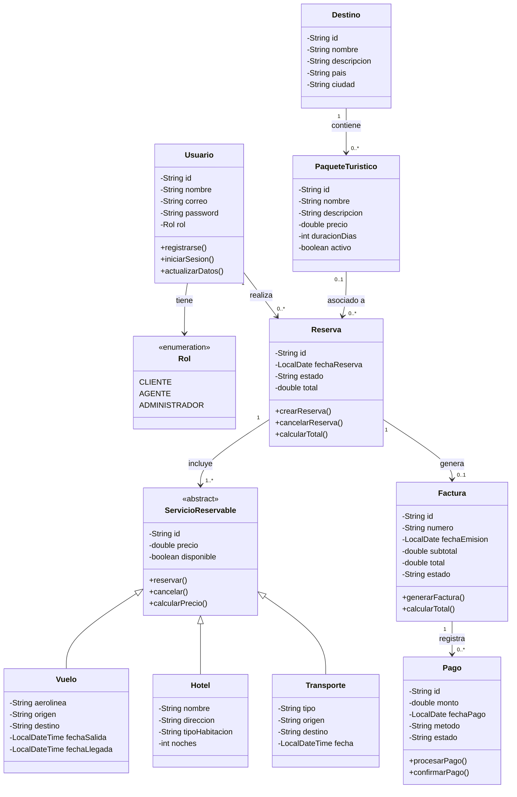

# Diagrama de Clases UML - TravelGo

## 1. Descripción

El diagrama de clases UML representa la estructura estática del sistema TravelGo, identificando las clases principales, sus atributos, métodos, relaciones y mecanismos de herencia.

El modelo está orientado al desarrollo de un sistema web para la gestión de una agencia de viajes, utilizando principalmente Java y programación orientada a objetos.

## 2. Diagrama de clases

## 3. Descripción de las clases

| Clase | Tipo | Responsabilidad |
|---|---|---|
| Usuario | Concreta | Gestionar los datos y la autenticación de los usuarios. |
| Rol | Enumeración | Definir los roles Cliente, Agente y Administrador. |
| Destino | Concreta | Representar los destinos turísticos disponibles. |
| PaqueteTuristico | Concreta | Representar los paquetes turísticos ofrecidos por la agencia. |
| Reserva | Concreta | Gestionar las reservas y calcular sus valores totales. |
| ServicioReservable | Abstracta | Definir los atributos y comportamientos comunes de los servicios reservables. |
| Vuelo | Concreta | Representar los servicios de transporte aéreo. |
| Hotel | Concreta | Representar los servicios de alojamiento. |
| Transporte | Concreta | Representar los servicios de transporte terrestre u otros medios. |
| Factura | Concreta | Gestionar la información de facturación. |
| Pago | Concreta | Registrar y gestionar los pagos asociados a las facturas. |

## 4. Relaciones entre las clases

- **Usuario y Rol:** cada usuario tiene un rol que determina su perfil dentro del sistema.
- **Usuario y Reserva:** un usuario puede realizar cero o muchas reservas.
- **Destino y PaqueteTuristico:** un destino puede estar asociado a varios paquetes turísticos.
- **PaqueteTuristico y Reserva:** una reserva puede estar asociada a un paquete turístico.
- **Reserva y ServicioReservable:** una reserva incluye uno o varios servicios reservables.
- **ServicioReservable y sus subclases:** Vuelo, Hotel y Transporte heredan de ServicioReservable.
- **Reserva y Factura:** una reserva puede generar una factura.
- **Factura y Pago:** una factura puede registrar cero o varios pagos.

## 5. Herencia y abstracción

La clase `ServicioReservable` se define como abstracta porque representa el comportamiento común de diferentes servicios turísticos.

Las clases `Vuelo`, `Hotel` y `Transporte` heredan de ella, reutilizando los atributos y métodos comunes y añadiendo los datos específicos de cada servicio.

Esta estructura permite aplicar los conceptos de herencia y polimorfismo de la programación orientada a objetos.

## 6. Encapsulamiento

Los atributos se declaran privados mediante el símbolo `-`, mientras que los métodos públicos se representan mediante el símbolo `+`.

En la implementación Java, el acceso a los atributos se gestionará mediante los métodos correspondientes y las validaciones necesarias.

## 7. Consideraciones técnicas

- El modelo está diseñado para orientar la implementación de las clases del dominio en Java.
- Los tipos `LocalDate` y `LocalDateTime` corresponden a clases de la API de fechas de Java.
- La enumeración `Rol` permite definir los perfiles de acceso del sistema.
- La clase abstracta `ServicioReservable` facilita la reutilización de comportamiento entre los distintos servicios turísticos.
- El modelo deberá mantenerse sincronizado con el modelo entidad-relación y con la implementación final del sistema.